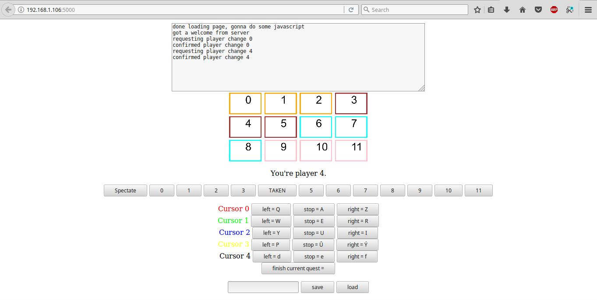
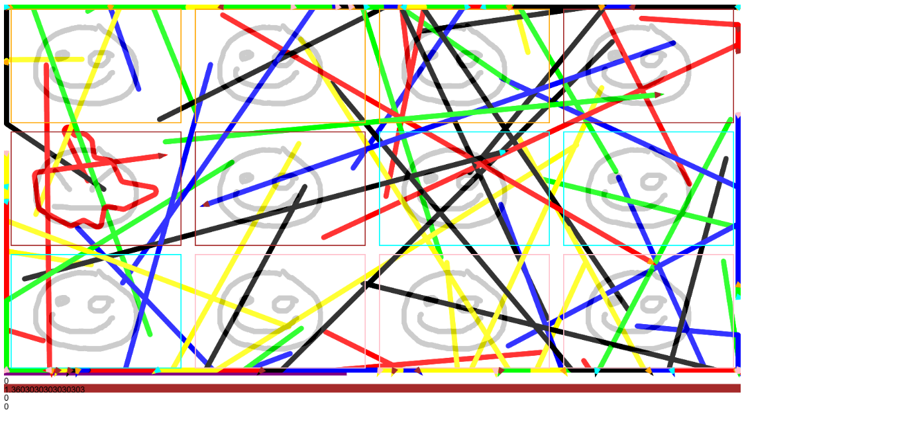

A painting game for the 66th KSP camp.

## Dependencies

To run the server, you need python packages `flask`, `flask_socketio`,
`pygame`. For the client, you only need an up-to-date web browser.

## How to start server

Start the server with the following command:
`FLASK_APP=paintgame.py flask run --host=0.0.0.0`

then find out your ip address (through `ip addr`), and distribute it
to the players so they can connect. (Use port `5000`, that is, if the
ip address is `192.168.1.106`, connect to `192.168.1.106:5000`.)

When all players who want to join have joined, you can start the game
by connecting to the secret page `avadakedavra`. (In the above example,
you would connect to `192.168.1.106:5000/avadakedavra`.) The game will
then start in 3 seconds.

## Client screen

The first is an informational log. It tells you about what the state
of the client and the communication between client and server.

Then, there is an image describing the game format. It shows the layout
of the canvas. Areas of players are marked by a colored rectangle, and
the player id is inside that rectangle. The color of the border
represents the team the player belongs to.

To join the game, click on a seat number that is not `TAKEN` (otherwise
you just watch). Then, you're ready for the game start.

Please do not disconnect from the page, nor refresh it once you
connected. The server has a hard time recognizing disconnects, and so
a seat that is in reality free is still considered taken for a long
time. If this occurs, the fastest solution is to restart the server.

In the lower part of the screen, you can adjust your controls, and save
them on the server side for later use. Just click on the action whose
key binding you want to change, and then press the key corresponding to
the new binding.

For each pen, we will give its default controls in the format (`key_left`,
`key_right`). Pen 1: (`1`, `Q`), pen 2: (`Z`, `X`), pen 3: (`V`, `B`),
pen 4: (`<`, `>`), pen 5: (`num6`, `num9`). You can finish the current
quest `Enter`.

## Game

The playing field is a large canvas. Each player has a scoring area
associated with him/her, and he/she has some pens, which are always moving
forward and leaving a trail of some color behind. The goal of the player
is to reproduce a pattern in as good quality as possible. Once the player
is satisfied, he can `finish the quest` and continue with the next
pattern.

Of course, players can interfere with each other. A player's pens are
not confined to the player's scoring area.

The goal of the game is to score as many points as possible for your
team, while keeping scores of opposing teams low. (You want to have
more points than your opponents.)

The game is played for a certain period of time. The remaining time is
represented by the purple bar in the lower part of the screen, and here
you can also find the scores of teams.

To ensure the game doesn't end too early (all teams finished all
patterns), there is a cooldown mechanic. You cannot finish a quest if
you have finished a quest in the last few seconds.

## Developer's corner

### Adding a new pattern, deleting old pattern

Place the image into `app/static/images/`, and modify
the StandardFormat data structure (found in `app/main/engine/formats.py`):
look for the attribute `image_files`, and add the name of the image
file into the list. The position in the list determines the order in
which the patterns are given out as quests.

To delete a pattern, simple remove its filename from the `image_files`
attribute.

### Change format

In the StandardFormat data structure, almost all attributes and methods
are self-explanatory. (Their names give a reasonable description of what
they mean and what role they play.)

Aside from `image_files`, the following attributes are safe
to change: `canvas_size`, `bg_color`, `cursor_move_speed`, `cursor_angle_speed`,
`cursor_width`, `color_names` (colors of pens), `granularity` (overall
pace of the game), `rounds` (length of game, in multiples of 50ms),
`cooldown` (again in multiples of 50ms). Methods `color_of(...)`,
`area_of(...)` and `team_of(...)` are also safe to change.

When changin one of `num_cursors`, `num_players`, `num_teams`, make
sure to change the `color_of(...)`, `area_of(...)` and `team_of(...)`
methods to include any additional cursors/players/teams. Also ensure
they are consistent (for example, a player belonging to a non-existent
team is **in**consistent).

All safe changes assume that the **changes made** are **reasonable**
(not setting `canvas_size` to `(-5, -asdf)`, ...).
